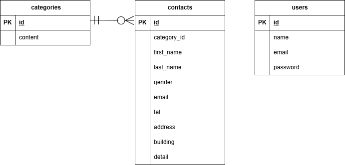

# アプリケーション名
FashionablyLate
お問い合わせフォームアプリケーションです。  
ユーザーがフォームから問い合わせを送信し、確認画面 → サンクスページへ進みます。  

管理者は、新規登録をすると、そのままログイン状態になり、自動で管理画面に遷移します。  
登録済みの場合は、ログインページでログイン後、管理画面に遷移します。

管理画面では、お問い合わせ一覧・検索・詳細・削除が可能です。

---


# 環境構築

## Dockerビルド
- git clone git@github.com:kokoro28k/fl-contact.git
- docker-compose up -d --build

## Laravel環境構築 
- docker-compose exec php bash
- composer install
- cp .env.example .env 環境変数を適宜変更
- php artisan key:generate APP_KEYの生成
- php artisan migrate
- php artisan db:seed

## トラブルシューティング（必要な場合）

環境によっては、Laravel がログやキャッシュを書き込む際に  
パーミッションエラーが発生する場合があります。

**例：**
The stream or file "/var/www/storage/logs/laravel.log" could not be opened in append mode: Permission denied

この場合は、以下のコマンドを実行してください。

```bash
docker-compose exec php bash
chmod -R 777 storage bootstrap/cache
```

## 開発環境
- お問い合わせ画面: [http://localhost/](http://localhost/)
- 新規登録画面: [http://localhost/register](http://localhost/register)
- phpMyAdmin: [http://localhost:8080/](http://localhost:8080/)


## 使用技術(実行環境)

- PHP 8.1(FPM)
- Laravel 8.x
- MySQL 8.0.26
- Docker / docker-compose
- nginx 1.21.1


## ER図



